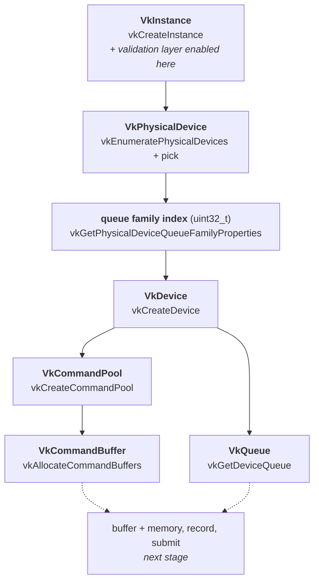

# Stage 1 — Setup: instance, device, queue, command buffer

Status: complete. Implemented in `src/main.cpp`.

This stage contains no image processing at all. It builds the minimum set of
Vulkan objects that must exist before any work can be sent to the GPU, and it
ends at the point where there is somewhere to record commands (`VkCommandBuffer`)
and somewhere to send them (`VkQueue`).

An editable version of the same diagram, with the reasoning attached to each
box, is in [`vulkan-init.drawio`](vulkan-init.drawio) (open at app.diagrams.net).

## The chain

Each object can only be made from the one above it — the parent handle is
literally an argument to the child's creation call, so no step can be skipped
or reordered.

| # | Object / value | Obtained by | Why it is needed |
|---|---|---|---|
| 1 | `VkInstance` | `vkCreateInstance` | The connection to the Vulkan loader. Until it exists, no function that touches hardware can be called. Layers are enabled here and nowhere else. |
| 2 | `VkPhysicalDevice` | `vkEnumeratePhysicalDevices` + selection | A *description* of an installed GPU. Queried, never created — the driver owns it. |
| 3 | queue family index | `vkGetPhysicalDeviceQueueFamilyProperties` | Not an object, just a `uint32_t`. Says which group of hardware engines accepts compute work. |
| 4 | `VkDevice` | `vkCreateDevice` | An open session with the chosen GPU. From here on, this is the handle passed to almost every call. |
| 5 | `VkQueue` | `vkGetDeviceQueue` | The channel work is submitted through. Comes into existence with the device; this call only retrieves the handle. |
| 6 | `VkCommandPool` | `vkCreateCommandPool` | Backing memory for recorded commands. Bound to one queue family, and not thread-safe — that is *why* pools exist: one pool per thread is what makes lock-free parallel recording possible. |
| 7 | `VkCommandBuffer` | `vkAllocateCommandBuffers` | Where commands are recorded before submission. Allocated from the pool, not created. |

Three different verbs appear here, and the verb decides the cleanup:

- `vkCreate*` — new object, **must** be destroyed with the matching `vkDestroy*`
- `vkGet*` / `vkEnumerate*` — hands back something that already exists, **never** destroyed
- `vkAllocate*` — carved out of a pool, freed **with the pool**, not individually

## Which handle goes in the first argument

Every `vkCreate*` takes its **parent** first — the object the new one belongs to
and dies with. The quickest way to check is to look at the destroy call:
`vkDestroyCommandPool(device, pool, nullptr)` takes `device`, so `device` is the
parent, so `device` is also the first argument to `vkCreateCommandPool`.

`VkPhysicalDevice` is nobody's parent. It is used for exactly two things:
queries (`vkGetPhysicalDevice*`) and `vkCreateDevice`. After the logical device
exists, it appears once more in this project — `vkGetPhysicalDeviceMemoryProperties`
in the buffer stage, because memory heaps are a property of the hardware, not of
the session.

## Two patterns that repeat for the rest of the project

### Pattern A — fill a create-info struct, then create

Used for the instance, the device and the command pool, and for every object
from here on: buffer, memory, pipeline, descriptor set layout.

1. zero-initialise: `VkXCreateInfo info{};`
2. set `info.sType` to the matching `VK_STRUCTURE_TYPE_*` — the driver identifies
   the struct by this field alone
3. fill the fields that matter, leave the rest zeroed
4. `vkCreateX(parent, &info, nullptr, &out)` — parent handle, info, allocator
   (always `nullptr` in this project), out-parameter
5. compare the returned `VkResult` against `VK_SUCCESS`

Create-infos **nest**: a small struct is pointed to from a bigger one, and the
small one is never passed to a function by itself.

    VkApplicationInfo       -> VkInstanceCreateInfo -> vkCreateInstance
    VkDeviceQueueCreateInfo -> VkDeviceCreateInfo   -> vkCreateDevice

### Pattern B — query the count first, then the data

Used for layers, physical devices and queue families.

1. call with a count pointer and `nullptr` for the data
2. size a `std::vector` to the returned count
3. call again with `vector.data()`

Some of these return `void` (`vkGetPhysicalDeviceQueueFamilyProperties`) and some
return `VkResult` (`vkEnumerateInstanceLayerProperties`). The `vkGet*` ones cannot
fail, so there is nothing to check.

### The "array of one" shape

Three fields so far take a pointer to an array whose length is given by a
neighbouring count field, and in every case the count is 1, so a plain variable's
address is passed:

| field | element type | passed as |
|---|---|---|
| `pQueuePriorities` | `float` | `&queuePriority` |
| `ppEnabledLayerNames` | `const char*` | `&validationLayerName` |
| out-param of `vkAllocateCommandBuffers` | `VkCommandBuffer` | `&commandBuffer` |

The pointed-to variable must still be alive when the call runs.

## Validation layers

Enabled at instance creation via `enabledLayerCount` + `ppEnabledLayerNames`, and
only there — there is no way to add a layer to an instance afterwards. The layer
is looked up by **name**: `"VK_LAYER_KHRONOS_validation"`. There is no `VkLayer`
type and no handle; the loader matches the string to a shared library and splices
it into the call chain.

Enabled conditionally (`vkEnumerateInstanceLayerProperties` first, then check the
list) so the program still runs on a machine without the layer installed —
requesting a missing layer makes `vkCreateInstance` fail with
`VK_ERROR_LAYER_NOT_PRESENT`.

Explicit layers like this one must be requested. Implicit ones (on this laptop,
`VK_LAYER_MESA_device_select`) load themselves and show up in the enumeration
whether asked for or not.

**Verifying the layer is actually live.** Silence is ambiguous: it means either
"no mistakes" or "layer not running". Prove it by breaking something on purpose.
A test that works: pass a queue index of `5` to `vkGetDeviceQueue` when only one
queue was requested, which produces
`VUID-vkGetDeviceQueue-queueIndex-00385`. A test that does *not* work: removing
`appInfo.sType = VK_STRUCTURE_TYPE_APPLICATION_INFO`, because that enum is `0`
and `VkApplicationInfo{}` already zeroes the field — the "broken" code is
identical to the correct code.

## Destruction order

Reverse of creation, children before parents:

    vkDestroyCommandPool(device, commandPool)
    vkDestroyDevice(device)
    vkDestroyInstance(instance)

`VkPhysicalDevice`, `VkQueue` and `VkCommandBuffer` are deliberately absent:
the first two were never created, and the third goes away with its pool. This
list grows with every stage, and keeping it an exact mirror of the creation
order is the whole discipline.

## Things that bit, or nearly did

- **Index 0 is a valid queue family**, so `0` cannot double as "not found".
  Sentinel is `UINT32_MAX` (`std::optional` would also work).
- **`queueFlags` is a bitfield, not a value.** A universal family reports `31`
  = graphics | compute | transfer | sparse | protected. Test with `&`, never
  `==`: `31 == VK_QUEUE_COMPUTE_BIT` is false even though that family does
  support compute.
- **A `break` in a loop that also prints** kills the diagnostic output along
  with the search. Guarding the assignment with `if (found == UINT32_MAX && ...)`
  keeps "first match wins" while letting the loop finish printing every family.
- **A layer is a string, not a handle.** `VkLayer` does not exist. If something
  is not returned by a `vkCreate*` or `vkGet*` call, it is not a handle.
- **A zeroed create-info still compiles and still runs.** `VkDeviceCreateInfo{}`
  with no fields set has `sType == 0`, which happens to be
  `VK_STRUCTURE_TYPE_APPLICATION_INFO`, and `queueCreateInfoCount == 0` creates a
  device with no queues. Nothing warns about either. The only accidental safety
  net was `-Wunused-but-set-variable` firing on the queue-create-info that had
  not yet been linked into the device-create-info — and that net disappears the
  moment the structs reference each other. This is why validation layers went in
  before command buffers rather than later.

## Device selection across the two machines

Selection prefers a discrete GPU and falls back to an integrated one, so the
same binary runs on the laptop and on the benchmark machine. Nothing branches on
vendor: the code queries properties and reacts to what it finds.

| | Iris Xe (laptop, dev) | RTX 3060 (benchmarks) |
|---|---|---|
| queue families | 1 | 6 |
| picked by the code | family 0 | family 0 |

Iris Xe reports a single universal family: `flags=31` (graphics, compute,
transfer, sparse, protected), 1 queue.

The 3060 exposes each hardware engine as its own family:

| family | queues | flags | decoded |
|---|---|---|---|
| 0 | 16 | 15 | graphics + compute + transfer + sparse — universal |
| 1 | 2 | 12 | transfer + sparse — copy DMA, no compute |
| 2 | 8 | 14 | compute + transfer + sparse — async compute, no graphics |
| 3 | 1 | 44 | video decode + transfer + sparse |
| 4 | 1 | 76 | video encode + transfer + sparse |
| 5 | 1 | 268 | optical flow (NV) + transfer + sparse |

Bits not seen on the laptop: `VK_QUEUE_VIDEO_DECODE_BIT_KHR` = 32,
`VK_QUEUE_VIDEO_ENCODE_BIT_KHR` = 64, `VK_QUEUE_OPTICAL_FLOW_BIT_NV` = 256.

"First family with `COMPUTE_BIT`" picks family 0 on both machines, which is
correct and portable. Worth trying at benchmark time: family 2 is a dedicated
compute engine with no graphics work competing for it — same code, one changed
index.

`llvmpipe` also shows up on the laptop as `deviceType = 4` (CPU). Selection
ignores it, and it is **not** the CPU leg of the FPGA/CPU/GPU comparison — that
needs a direct C++ implementation of the algorithm, not a software Vulkan
rasteriser.

## Next

Continues in [Stage 2 — Buffers and memory](02-buffers-and-memory.md).
