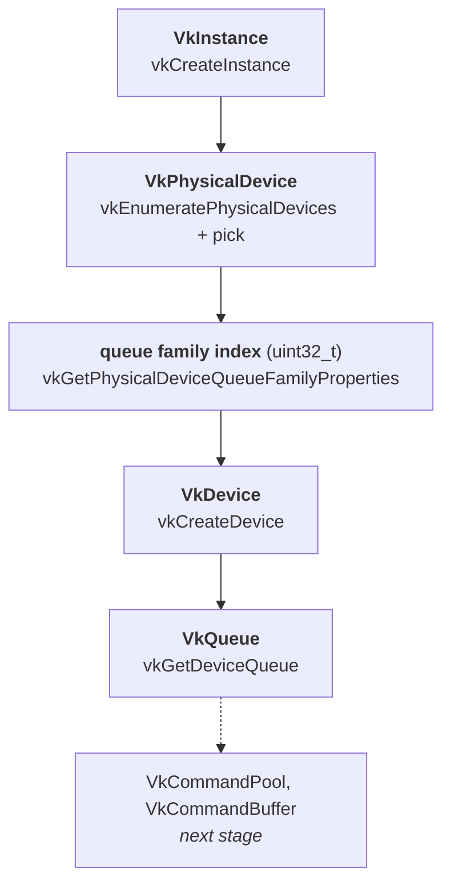

# Stage 1 — Instance, device, compute queue

Status: complete. Implemented in `src/main.cpp`.

This stage contains no image processing at all. It builds the minimum set of
Vulkan objects that must exist before any work can be sent to the GPU.

An editable version of the same diagram, with the reasoning attached to each
box, is in [`vulkan-init.drawio`](vulkan-init.drawio) (open at app.diagrams.net).

## The chain

Each object can only be made from the one above it — the parent handle is
literally an argument to the child's creation call, so no step can be skipped
or reordered.

| # | Object / value | Obtained by | Why it is needed |
|---|---|---|---|
| 1 | `VkInstance` | `vkCreateInstance` | The connection to the Vulkan loader. Until it exists, no function that touches hardware can be called. |
| 2 | `VkPhysicalDevice` | `vkEnumeratePhysicalDevices` + selection | A *description* of an installed GPU. Queried, never created — the driver owns it. |
| 3 | queue family index | `vkGetPhysicalDeviceQueueFamilyProperties` | Not an object, just a `uint32_t`. Says which group of hardware engines accepts compute work. |
| 4 | `VkDevice` | `vkCreateDevice` | An open session with the chosen GPU. From here on, this is the handle passed to almost every call. |
| 5 | `VkQueue` | `vkGetDeviceQueue` | The channel work is submitted through. Comes into existence with the device; this call only retrieves the handle. |

Note the asymmetry between `vkCreate*` and `vkGet*`: create makes something new,
get hands back something that already exists. **Only what was created has to be
destroyed.**

## Two patterns that repeat for the rest of the project

### Pattern A — fill a create-info struct, then create

Used for the instance and the device, and for every object from here on:
command pool, buffer, memory, pipeline, descriptor set layout.

1. zero-initialise: `VkXCreateInfo info{};`
2. set `info.sType` to the matching `VK_STRUCTURE_TYPE_*` — the driver identifies
   the struct by this field alone
3. fill the fields that matter, leave the rest zeroed
4. `vkCreateX(parent, &info, nullptr, &out)` — parent handle, info, allocator
   (always `nullptr` in this project), out-parameter
5. compare the returned `VkResult` against `VK_SUCCESS`

Create-infos **nest**: a small struct is pointed to from a bigger one, and the
small one is never passed to a function by itself.

    VkApplicationInfo       -> VkInstanceCreateInfo -> vkCreateInstance
    VkDeviceQueueCreateInfo -> VkDeviceCreateInfo   -> vkCreateDevice

### Pattern B — query the count first, then the data

Used for physical devices and for queue families.

1. call with a count pointer and `nullptr` for the data
2. size a `std::vector` to the returned count
3. call again with `vector.data()`

The `vkGet*` functions in this pattern return `void`, not `VkResult` — they
cannot fail, so there is nothing to check.

## Destruction order

Reverse of creation, children before parents:

    vkDestroyDevice(device)  ->  vkDestroyInstance(instance)

`VkPhysicalDevice` and `VkQueue` are deliberately absent: neither was created,
so neither is destroyed (there is no `vkDestroyQueue`). This list grows with
every stage, and keeping it an exact mirror of the creation order is the whole
discipline.

## Device selection across the two machines

Selection prefers a discrete GPU and falls back to an integrated one, so the
same binary runs on the laptop and on the benchmark machine. Nothing branches on
vendor: the code queries properties and reacts to what it finds.

| | Iris Xe (laptop, dev) | RTX 3060 (benchmarks) |
|---|---|---|
| queue families | 1 | expected several |
| family 0 | `flags=31`, 1 queue | universal, many queues |
| others | — | compute-only, transfer-only, video (to confirm) |

`llvmpipe` also shows up on the laptop as `deviceType = 4` (CPU). Selection
ignores it, and it is **not** the CPU leg of the FPGA/CPU/GPU comparison — that
needs a direct C++ implementation of the algorithm, not a software Vulkan
rasteriser.

## Next

1. validation layers (`VK_LAYER_KHRONOS_validation`) — before command buffers,
   because from that point on misuse fails silently
2. `VkCommandPool` -> `VkCommandBuffer`
3. buffer + memory allocation (staging -> device-local, written the discrete way
   from the start so the 3060 numbers mean something)
