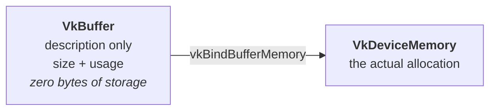

# Stage 2 — Buffers and memory

Status: **complete.** Buffers are created, backed by memory, filled with a test
pattern, and the round trip through them is verified in
[Stage 3](03-recording-and-submission.md).

Implemented in `src/main.cpp`: `findMemoryType()` and `createBuffer()` above
`main()`, and the buffer block inside it.



See [`buffer-memory.drawio`](buffer-memory.drawio) for the full picture,
including the observed memory map and the data path.

## The one idea this stage is built on

In most APIs "create a buffer" hands you memory. In Vulkan it does not.

`VkBuffer` is a **description** — this many bytes, used in these ways. It
contains no storage. `VkDeviceMemory` is a separate allocation of GPU-visible
memory. `vkBindBufferMemory` ties the two together.

The reason is that driver allocations are expensive and limited
(`maxMemoryAllocationCount`, typically 4096). Real applications allocate a few
large blocks and sub-allocate many buffers inside them at different offsets.
Vulkan does not hide this, because hiding it would mean the driver guessing.
This project allocates one block per buffer, but the API is shaped for the other
case — which is why `vkBindBufferMemory` takes an offset.

## Heaps and types

`vkGetPhysicalDeviceMemoryProperties(physicalDevice, &memProps)` returns both
lists at once:

- **`memoryHeaps[]`** — physical pools, each with a size and flags
- **`memoryTypes[]`** — *ways of accessing* a heap; each names a `heapIndex` and
  a set of `propertyFlags`

The same heap appears as several types with different properties.

| Flag | Value | Meaning |
|---|---|---|
| `DEVICE_LOCAL` | 1 | fast GPU memory |
| `HOST_VISIBLE` | 2 | CPU can map and write it |
| `HOST_COHERENT` | 4 | CPU writes become visible without an explicit flush |
| `HOST_CACHED` | 8 | cached on the CPU side (fast to read back) |

**A third struct shape.** This is neither Pattern A nor Pattern B:
`VkPhysicalDeviceMemoryProperties` is one struct holding fixed-size arrays
(`memoryTypes[32]`, `memoryHeaps[16]`) with the real lengths as fields inside it
(`memoryTypeCount`, `memoryHeapCount`). No count-first call, no vector.

## `findMemoryType` — two bit tests that are not the same test

```
(typeFilter & (1u << i)) != 0
(memProps.memoryTypes[i].propertyFlags & properties) == properties
```

**Test 1** asks "is type *i* allowed?". `typeFilter` — which comes from
`memRequirements.memoryTypeBits` — is a mask where **bit _i_ means type _i_ is
usable for this buffer**. `1u << i` builds a mask with only that bit.
`1u`, not `1`: `1 << 31` on a signed `int` is undefined behaviour.

**Test 2** asks "are *all* the requested properties present?". `&` keeps the
requested bits that are set; if the result equals the request, none were
missing.

The `== properties` matters. Earlier, on `queueFlags`, `==` was the wrong
operator and plain `&` was right — because that test was for **one** bit. Here
several bits are tested at once, and a plain `&` would accept a type that
satisfies only some of them. The rule is not "always use `&`" but "match the
test to the question".

## `createBuffer` — five steps

1. `vkCreateBuffer` — `VkBufferCreateInfo` with `size`, `usage`, and
   `sharingMode = VK_SHARING_MODE_EXCLUSIVE` (one queue family at a time; the
   only correct choice in this project)
2. `vkGetBufferMemoryRequirements` — returns `size`, `alignment` and
   `memoryTypeBits`. **Allocate `memRequirements.size`, not the requested size**;
   the driver may need more for alignment
3. `findMemoryType(physicalDevice, memRequirements.memoryTypeBits, properties)`
4. `vkAllocateMemory` — `VkMemoryAllocateInfo` with `allocationSize` and
   `memoryTypeIndex`
5. `vkBindBufferMemory(device, buffer, memory, 0)` — the trailing `0` is the
   offset inside the allocation

`usage` must declare every future use up front. Using a buffer in a way that was
not declared is invalid, and the validation layer catches it.

## The three buffers

Size is the real image: 1280 x 720 x 2 bytes (RGB565) = 1 843 200 B.

| Buffer | `usage` | `properties` |
|---|---|---|
| `stagingIn` | `TRANSFER_SRC` | `HOST_VISIBLE \| HOST_COHERENT` |
| `deviceBuffer` | `TRANSFER_DST \| TRANSFER_SRC \| STORAGE_BUFFER` | `DEVICE_LOCAL` |
| `stagingOut` | `TRANSFER_DST` | `HOST_VISIBLE \| HOST_COHERENT` |

Three separate buffers, not two, so that the round-trip test is honest: writing
and reading the same staging buffer would pass even if the data never reached
the GPU.

`STORAGE_BUFFER` is on `deviceBuffer` already, before any shader exists — it is
the flag that lets a shader access it, and adding it now saves a change later.

`stagingIn` is filled through `vkMapMemory` / `vkUnmapMemory` with a pattern
(`i & 0xFFFF`). `HOST_COHERENT` is why no `vkFlushMappedMemoryRanges` is needed.

## Observed memory map

### RTX 3060 (benchmark machine)

| Heap | Size | Flags | What it is |
|---|---|---|---|
| 0 | 12288 MiB | `DEVICE_LOCAL` | VRAM |
| 1 | 14838 MiB | — | system memory |
| 2 | 246 MiB | `DEVICE_LOCAL` | BAR window — VRAM the CPU can see directly |

| Type | Heap | Flags (raw) | Decoded |
|---|---|---|---|
| 0 | 1 | 0 | — |
| 1 | 0 | 1 | `DEVICE_LOCAL` |
| 2 | 0 | 1 | `DEVICE_LOCAL` |
| 3 | 1 | 6 | `HOST_VISIBLE \| HOST_COHERENT` |
| 4 | 1 | 14 | `HOST_VISIBLE \| HOST_COHERENT \| HOST_CACHED` |
| 5 | 2 | 7 | `DEVICE_LOCAL \| HOST_VISIBLE \| HOST_COHERENT` |

Buffers land on types **3, 1, 3** — staging in system memory, device buffer in
VRAM, different heaps. The copy is therefore a real PCIe transfer, which is
exactly what should be measured.

### Iris Xe (laptop, dev)

| Heap | Size | Flags | What it is |
|---|---|---|---|
| 0 | 11790 MiB | `DEVICE_LOCAL` | system memory, shared with the CPU |

One heap, not three. Every type points at it.

| Type | Heap | Flags (raw) | Decoded |
|---|---|---|---|
| 0 | 0 | 1 | `DEVICE_LOCAL` |
| 1 | 0 | 7 | `DEVICE_LOCAL \| HOST_VISIBLE \| HOST_COHERENT` |
| 2 | 0 | 15 | `DEVICE_LOCAL \| HOST_VISIBLE \| HOST_COHERENT \| HOST_CACHED` |
| 3 | 0 | 33 | `DEVICE_LOCAL \| PROTECTED` (`VK_MEMORY_PROPERTY_PROTECTED_BIT` = 32) |
| 4 | 0 | 1 | same flags as type 0 |
| 5 | 0 | 7 | same flags as type 1 |
| 6 | 0 | 15 | same flags as type 2 |

Types 4-6 repeat the flags of 0-2. Whatever separates them is not visible in
`propertyFlags`; which of them a given buffer may use is decided by the
`memoryTypeBits` mask in its memory requirements.

Buffers land on types **1, 0, 1** — and every type is `DEVICE_LOCAL`, on the one
heap. So on this machine `stagingIn` and `deviceBuffer` are in the same physical
memory and the "PCIe transfer" is not a transfer at all.

The three-buffer structure is still the right code: it is correct here and costs
almost nothing, and it is the only shape that measures anything real on the 3060.
This is what "query, do not branch on vendor" buys — the same binary does the
sensible thing on both machines because the *data* differs, not the code.

`findMemoryType` answers differ accordingly: `DEVICE_LOCAL|HOST_VISIBLE` returns
1 here and 5 on the 3060. The broken-`&` check from the verification list still
catches a bug here too — a plain `&` would return 0 instead of 1.

## How each step was verified before moving on

Each piece was checked against known-good data before the next one was written.
This is why the stage went in without a debugging session:

1. print the memory map from own code, compare against `vulkaninfo` — 3 heaps,
   6 types, matching flags
2. call `findMemoryType` by hand with `typeFilter = UINT32_MAX` and predict the
   answers from the table above:
   `HOST_VISIBLE|HOST_COHERENT` -> 3, `DEVICE_LOCAL` -> 1,
   `DEVICE_LOCAL|HOST_VISIBLE` -> 5
3. allocate the three buffers and check they land on 3, 1, 3

Test 3 in step 2 is the one that catches a broken `findMemoryType`: with a plain
`&` instead of `== properties`, the first two still answer correctly and only the
third returns 1 instead of 5.

## Cleanup

**Two objects per buffer**, because the buffer and its memory are separate:

    vkDestroyBuffer(device, buffer, nullptr);
    vkFreeMemory(device, memory, nullptr);

Six lines for three buffers, ahead of `vkDestroyCommandPool`. `main.cpp` is now
360 lines and the hand-maintained teardown list is where the weight is landing —
that is the argument for the context struct planned after the round-trip test.

## Next

Continues in [Stage 3 — Recording, barriers and submission](03-recording-and-submission.md),
which records the round trip, submits it and verifies the bytes survived.

Predictions made here that stage 3 confirmed: the barrier was indeed required,
and the validation layer indeed said nothing about synchronisation until it was
asked to.
