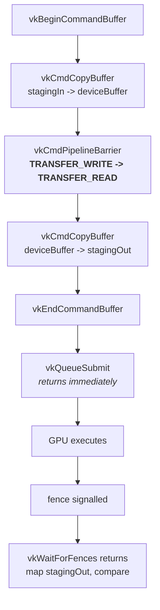

# Stage 3 — Recording, barriers and submission

Status: **complete.** The round trip runs and verifies:
`stagingIn -> deviceBuffer -> stagingOut`, 921 600 values compared, no shader
involved.

Implemented in `src/main.cpp` between the buffer block and cleanup.

See [`recording-submission.drawio`](recording-submission.drawio) for the CPU/GPU
timeline version.

## A different shape from everything before

Stages 1 and 2 were all one pattern: fill a create-info, call `vkCreate*`, check
`VK_SUCCESS`. This stage is the second pattern family in Vulkan, and it does not
look like the first at all:

    vkBegin...  ->  vkCmd* (many)  ->  vkEnd...  ->  submit  ->  wait

Three properties that have no equivalent in stages 1-2:

- **`vkCmd*` functions return `void` and do nothing when called.** They append
  bytes to the command buffer. Errors surface later, at submit time or not at
  all.
- **Nothing reaches the GPU until `vkQueueSubmit`.** Recording is pure
  bookkeeping on the CPU.
- **`vkQueueSubmit` does not block.** It returns as soon as the work is queued.
  The fence is the only way to learn that it finished.

## Recording

| Call | Notes |
|---|---|
| `vkBeginCommandBuffer` | `VkCommandBufferBeginInfo` with `VK_COMMAND_BUFFER_USAGE_ONE_TIME_SUBMIT_BIT` — a promise to the driver that this recording is submitted once, which lets it optimise. Re-recording is required before reuse. |
| `vkCmdCopyBuffer` | Takes `VkBufferCopy` (`srcOffset`, `dstOffset`, `size`). **No `sType`** — small parameter structs that are never handed to a `vkCreate*` do not carry one. |
| `vkCmdPipelineBarrier` | See below. |
| `vkCmdCopyBuffer` | Same `VkBufferCopy` reused, opposite direction. |
| `vkEndCommandBuffer` | Returns `VkResult`; this is where a malformed recording is reported. |

## The barrier is the content of this stage

**Recording order is not execution order.** Vulkan guarantees only that commands
*begin* in the order recorded. They may overlap and finish in any order. Without
a barrier the second copy is free to read `deviceBuffer` before the first copy
has finished writing it.

This is the same problem as a data hazard between pipeline stages in RTL, and the
fix is the same in spirit: state the dependency explicitly rather than relying on
timing that happens to work.

A `VkBufferMemoryBarrier` has two halves:

| Half | Fields | Question it answers |
|---|---|---|
| source | `srcStageMask`, `srcAccessMask` | what must **finish** first — here `TRANSFER` stage, `TRANSFER_WRITE` access |
| destination | `dstStageMask`, `dstAccessMask` | what must **wait** — here `TRANSFER` stage, `TRANSFER_READ` access |

plus `buffer` / `offset` / `size` to say which memory, and two queue-family
fields that are **not part of the memory dependency at all**.

### The bug that broke the first run

`VkBufferMemoryBarrier` does double duty: a memory dependency *and* a queue
family ownership transfer. Which one is meant is decided by comparing
`srcQueueFamilyIndex` and `dstQueueFamilyIndex`:

- both `VK_QUEUE_FAMILY_IGNORED` -> plain memory barrier
- different values -> ownership transfer, which requires a **matching pair**: a
  release barrier on the source queue and an acquire barrier on the destination

Only `srcQueueFamilyIndex` was set. `dstQueueFamilyIndex` kept its zero from
`VkBufferMemoryBarrier{}` — and `0` is a real queue family, the one in use. The
layer read it as an acquire with no release:

    UNASSIGNED-VkBufferMemoryBarrier-buffer-00004
    ... from srcQueueFamilyIndex 4294967295 to dstQueueFamilyIndex 0
    has no matching release barrier queued for execution

`4294967295` is `VK_QUEUE_FAMILY_IGNORED` (`UINT32_MAX`), which makes the
mismatch readable straight from the message.

**Third instance of the same trap.** Zero is a valid value in a field that needs
to mean "nothing":

| field | zeroed value | what it actually means |
|---|---|---|
| `sType` | `0` | `VK_STRUCTURE_TYPE_APPLICATION_INFO` |
| `queueCreateInfoCount` | `0` | a device with no queues |
| `dstQueueFamilyIndex` | `0` | queue family 0 — a real family |

This is also why Vulkan spells "no family" as `VK_QUEUE_FAMILY_IGNORED =
UINT32_MAX` instead of `0` — the same reasoning that made `computeFamily` use
`UINT32_MAX` as its own sentinel back in stage 1.

### Synchronisation validation is off by default

The default validation layer checks struct validity, not whether the barriers are
*correct*. Deleting the barrier entirely still passes on the laptop: one queue,
1.8 MB, nothing to overlap with. That is exactly the failure mode to fear —
correct-looking on the dev machine, wrong on the 3060.

    VK_LAYER_ENABLES=VK_VALIDATION_FEATURE_ENABLE_SYNCHRONIZATION_VALIDATION_EXT ./build/vpv

Worth keeping on for the rest of the project.

## Fence and submit

`VkFence` is a **GPU-to-CPU** signal. `VkSemaphore` is GPU-to-GPU, for ordering
work between queues — not needed yet.

- `VkSubmitInfo`: `commandBufferCount = 1`, `pCommandBuffers = &commandBuffer` —
  the array-of-one shape for the fourth time
- `vkQueueSubmit(computeQueue, 1, &submitInfo, fence)` — the first actual use of
  the queue retrieved back in stage 1
- `vkWaitForFences(device, 1, &fence, VK_TRUE, UINT64_MAX)` — the timeout is in
  **nanoseconds**; `UINT64_MAX` means wait indefinitely

## Reading the result back

`vkMapMemory` writes an address into a `void*`. A `void*` has no element size, so
it cannot be indexed or dereferenced — the compiler does not know whether to step
1, 2 or 4 bytes.

    uint16_t* pixels = static_cast<uint16_t*>(data);

**Nothing happens at run time.** No copy, no conversion, no reordering of bits;
`data` and `pixels` hold the same address. Only the compiler's idea of the
element type changes, which is what makes `pixels[i]` step two bytes and read one
RGB565 pixel. C would convert `void*` implicitly; C++ requires the cast to be
written because it cannot verify the claim.

Two `static_cast`s sit on adjacent lines and do different jobs:

| expression | kind | effect |
|---|---|---|
| `static_cast<uint16_t*>(data)` | pointer | same address, new element type |
| `static_cast<uint16_t>(i & 0xFFFF)` | value | 64-bit `size_t` narrowed to 16 bits |

**A Vulkan buffer is only bytes.** The GPU has no idea they are pixels. The type
exists in exactly two places: this cast, and the shader's own declaration of the
same buffer — and the two must agree. That is the layout decision waiting in
stage 4, because GLSL's natural storage-buffer element is 32 bits wide while a
RGB565 pixel is 16.

## Cleanup

`vkDestroyFence(device, fence, nullptr)` joins the list, ahead of the buffers.
The command buffer still does not appear — the pool owns it.

## Result

    Filled stagingIn with a test pattern.
    Copy test PASSED: stagingIn -> deviceBuffer -> stagingOut

Verified on Iris Xe. The whole path is exercised: CPU write through a mapped
pointer, submit, GPU copy, barrier, GPU copy, fence signal, CPU read, 921 600
values compared.

## Tooling note

`CMakeLists.txt` does not enable warnings. Adding

    target_compile_options(vpv PRIVATE -Wall -Wextra)

would have caught two things in this project unaided: the `VkDeviceQueueCreateInfo`
that was filled but never linked into `VkDeviceCreateInfo`, and the `success` flag
that was computed but never printed, which made a passing run produce no output at
all.

## Next

1. **Split `main.cpp`** — 345 lines, three distinct concerns (one-time setup,
   buffer helpers, the test itself). Doing it now means refactoring code that is
   known to work.
2. **First compute shader: grayscale.** The recording above barely changes — a
   `vkCmdDispatch` goes between the two copies, with the barrier before it
   becoming `TRANSFER_WRITE -> SHADER_READ` and a second barrier after it for
   `SHADER_WRITE -> TRANSFER_READ`. The new work is all in the objects around the
   dispatch: shader module, descriptor set layout, descriptor pool, descriptor
   set, pipeline layout, compute pipeline.
